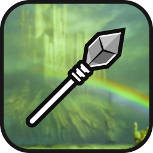

## Dev ##

# About ChatGungnir 🏔️

*"With Gungnir in hand, Odin could conquer any realm, including Asgard itself."*

Gungnir was the magical spear of Odin in Norse mythology, known for its precision and unstoppable power. This play on words replaces "PT" with "Gungnir," implying that ChatGungnir is a platform that is precise, powerful, and unstoppable in facilitating communication. It also suggests that users of the platform can expect to communicate with clarity and accuracy, just as Gungnir never missed its mark.

---

## Lorem Ipsum

This workflow allows you to quickly search for current weather information for any location using the [OpenWeatherMap API](https://openweathermap.org/).

To use the workflow, simply type `weather` followed by the name of the location you want to search for. For example:

This will display the current weather information for London.

You can also use the `weather` keyword without any arguments to open the weather search prompt, where you can enter the location you want to search for.

Note that the workflow requires an API key from OpenWeatherMap. You can obtain a free API key by [creating an account on their website](https://home.openweathermap.org/users/sign_up). Once you have your API key, simply add it to the workflow's configuration variables.

Enjoy the weather search workflow!

This will display the current weather information for London.

You can also use the `weather` keyword without any arguments to open the weather search prompt, where you can enter the location you want to search for.

Note that the workflow requires an API key from OpenWeatherMap. You can obtain a free API key by [creating an account on their website](https://home.openweathermap.org/users/sign_up). Once you have your API key, simply add it to the workflow's configuration variables.

Enjoy the weather search workflow!