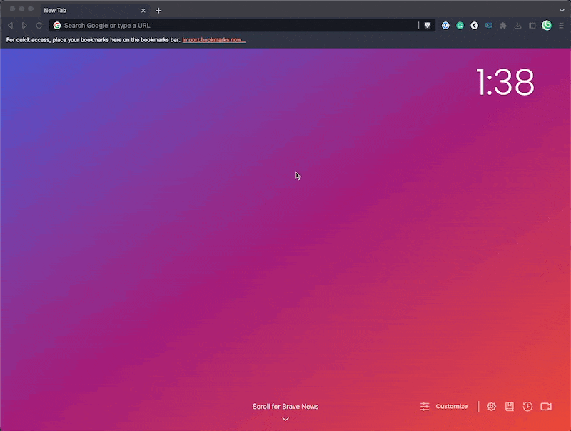
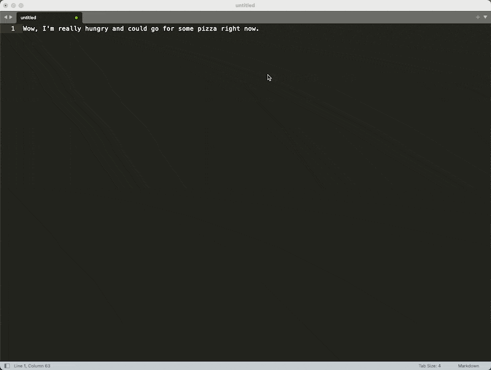

# About ChatGungnir 🏔️

*"With Gungnir in hand, Odin could conquer any realm, including Asgard itself."*

Gungnir was the magical spear of Odin in Norse mythology, known for its precision and unstoppable power. This play on words replaces "PT" with "Gungnir," implying that ChatGungnir is a platform that is precise, powerful, and unstoppable in facilitating communication. It also suggests that users of the platform can expect to communicate with clarity and accuracy, just as Gungnir never missed its mark.

---

## How Does It Work? 

<<<<<<< HEAD
This Alred workflow allows you to quickly search https://chat.openai.com/ based on an input provided. There are a few ways to work with your data, each of which are outlined below. 

This workflow is designed to work with both **paid and free accounts** for ChatGPT. 
=======
This Alred workflow allows you to quickly search https://chat.openai.com/ based on an input provided. 

To use the workflow, simply type `chat` (or whichever keyword you determine) followed by your question or request.
>>>>>>> d34fa2912a9475d0112b235fc62f6fc130cf4b6a

### Method #1 - Basic Search

<<<<<<< HEAD
To use the workflow, simply type `chat` (or whichever keyword you determine) followed by your question or request.

### Method #2 - Universal Actions

You can also initiate this workflow using Alfred's [Universal Actions](https://www.alfredapp.com/universal-actions/). This function allows to highlight text and then interact with it based on a prompt added in the Workflow. 
=======

You can also initiate this workflow using Alfred's [Universal Actions](https://www.alfredapp.com/universal-actions/). This function allows to highlight text and then itneract with it based on a prompt added in the Workflow. 

For example, 
>>>>>>> d34fa2912a9475d0112b235fc62f6fc130cf4b6a

Note that the workflow requires an API key from OpenWeatherMap. You can obtain a free API key by [creating an account on their website](https://home.openweathermap.org/users/sign_up). Once you have your API key, simply add it to the workflow's configuration variables.

### Method #3 - List Filter Prompts

Similar to `Method #2`, you can use select your prompts from a list filter by pressing and holding command and typing your selected keyword. This will take the **most recent clipboard** item and apply the prompt to it. 

## Notes/FAQ

<<<<<<< HEAD
1. The workflow is currently only available for use with the Brave browser, but it can be adapted upon request. 
2. This is very much a beta product: further testing is needed to 
3. "Does it work well enough to use in my day-to-day work?" → Yes, it is! :) I use it almost every day in some way, shape, or form. 
=======

Note that the workflow requires an API key from OpenWeatherMap. You can obtain a free API key by [creating an account on their website](https://home.openweathermap.org/users/sign_up). Once you have your API key, simply add it to the workflow's configuration variables.

Enjoy the weather search workflow!
>>>>>>> d34fa2912a9475d0112b235fc62f6fc130cf4b6a
